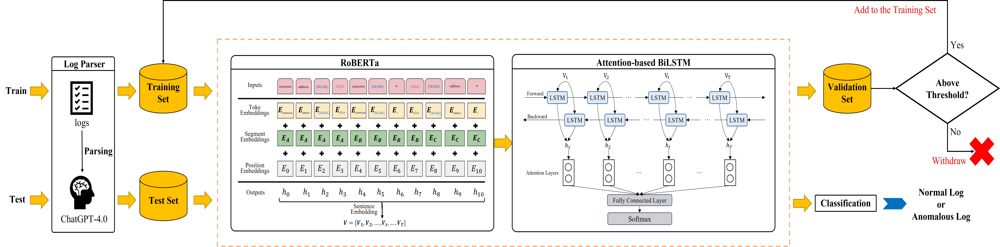

# SemiRALD: A Semi-supervised Hybrid Language Model for Robust Anomalous Log Detection

This paper proposes SemiRALD, a Semi-supervised learning-based Robust ALD approach. SemiRALD utilizes ChatGPT and in-context learning for automated log parsing, thereby improving the log integrity during log parsing. Subsequently, it harnesses a semi-supervised learning framework and our proposed hybrid language model to remedy the performance degeneration caused by low-resource restriction in practice.

## Datasets

- LogRoBERTa and other benchmark models are implemented on [HDFS](https://github.com/logpai/loghub/tree/master/HDFS) and [BGL](https://github.com/logpai/loghub/tree/master/BGL) datasets

- Please note that due to the large size of the datasets, we have not included the original files in the GitHub repository. You can download the corresponding dataset files by clicking on the provided link.
